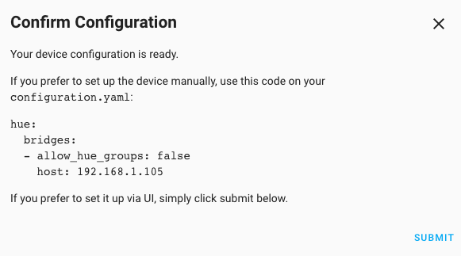
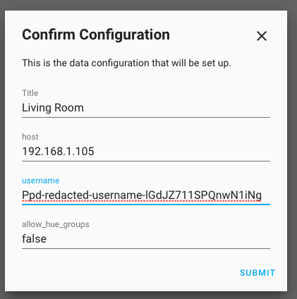

# Hue Experiment

This is an experiment to showcase how UI flow can act as a self-documenting feature for YAML configuration.

---

## Objectives

### What was the objective

To showcase that the UI configuration flow can be used to generate the same data needed for the `configuration.yaml` and allow the user to take the last decision on the configuration.

The underlying objective is to prove that the same `config_flow` can be used to set up both UI and YAML configuration without adding significant cost to the component owner.

### What was *not* the objective

To implement the code required to read YAML configuration. This is why we focused on Hue component which still supports YAML configuration.

This experiment is also not intended to be a `custom_component` as the original core component has all the required documentation and features, but it could be used in the future. Nonetheless, this would work if it gets installed as a `custom_component`.

---

## What was required to make it work

The only change required is to add an additional setup before `async_create_entry` that confirms the output with the user for validation.

### 0. Understanding the original device creation

The method `async_step_link` in the `hue` core component is responsible for getting the bridge information and creating the entry device. This is the logic responsible for this:

```python
async def async_step_link(self, user_input=None):
  # ...
    return self.async_create_entry(
        title=bridge.config.name,
        data={
            "host": bridge.host,
            "username": bridge.username,
            CONF_ALLOW_HUE_GROUPS: False,
        },
    )
  # ...
```

However, we wanted to add an additional step to ensure that we could validate and read the configuration. As such, we have replaced this logic with a few changes described below.

### 1. Store device data into a class attribute

Instead of directly creating the entry, we store the data required into a class attribute, which will allow us to use it later to finally create the entry.

```python
  self._set_up_data = {
      'title': title,
      'data': {
          'host': host,
          'username': username,
          'allow_hue_groups': allow_hue_groups,
      }
  }
```

> Note: while it was not required, for this experiment, we have stored the original values into variables as we will be using them in two different places on this implementation.

```python
  title = bridge.config.name
  host = bridge.host
  username = bridge.username
  allow_hue_groups = False
```

### 2. Format data into YAML Configuration format

Change the format from config_entry (`_set_up_data`) to the one required by YAML configuration.

```python
import yaml

yaml_data = {
    'hue': {
        'bridges': [{
            'host': host,
            'allow_hue_groups': allow_hue_groups,
        }]
    }
}
yaml_configuration = yaml.dump(yaml_data)
```

> Note: `yaml_data` is only required because the data required by `async_create_entry` and YAML configuration are different. We advocate to have an equivalent setup so there is no need to maintain two different schemas. If this was true, this would only have required this line: `yaml_configuration = yaml.dump(self._set_up_data)`

### 3. Show data before creating the device

We need to edit the original `async_step_link` to make a call to a new step before calling `async_create_entry`. This is done by passing the previous data into a form like this:

```python
return self.async_show_form(
    step_id="confirmation",
    description_placeholders={
        'yaml': yaml_configuration,
    }
)
```

> Note: this logic replaces the previously described `return self.async_create_entry(...)`.


### 4. Add additional step to show YAML configuration

When the form is executed, it triggers a form which will show the YAML data. Once the user submits the form, it will create the entry. The code responsible for this:

```python
  async def async_step_confirmation(self, user_input=None):
    """Creates device entries after confirmation."""
    if not self._set_up_data:
      raise ValueError('Configuration flow failed.')

    return self.async_create_entry(
        title=self._set_up_data.get('title'),
        data=self._set_up_data.get('data'),
    )
```

As a new step is created, you need to also add some translations to show the message:

```json
"confirmation": {
  "title": "Confirm Configuration",
  "description": "Your device configuration is ready. \n\nIf you prefer to set up the device manually, use this code on your `configuration.yaml`:\n\n```yaml\n{yaml}```\n\nIf you prefer to set it up via UI, simply click submit below."
}
```

### Summary

While the boilerplate may seem long, by sharing the same configuration structure between YAML and UI, this would only require to make one `self.async_create_entry()` with a yaml processed details of the device to really make it work. This should not require more than 5-10 lines of code (including English strings) and provide great functionality.

### Result

This will show the following message in the UI:



The user can copy the code into `configuration.yaml` or simply press submit to complete the UI setup.

---

## Alternative implementations

This implementation may not look friendly for UI-only users. There are a few ways to improve this.

### Optional YAML configuration

One option is to only showcase the YAML configuration to those who are YAML configuration. This could be a user flag that allows us to know if it's an advanced user or not. This is similar to enabling/disabling lovelace dashboards or showing the `Developer Tools`.

The code will be something like this:

```python
if is_advanced_user:
  return self.async_show_form(
      step_id="confirmation",
      description_placeholders={
          'yaml': yaml_configuration,
      }
  )
else:
  return self.async_step_confirmation()
```

### Make configuration editable

Another option is to additionally show the configuration data to the user, so they can Edit it. This is not a replacement for YAML configuration, but a way to make this confirmation box also users by UI-only users.

This would require defining the form data via a Schema:

```python
  data_schema = voluptuous.Schema({
      voluptuous.Required("title", default=title): str,
      voluptuous.Required("host", default=host): str,
      voluptuous.Required("username", default=username): str,
      voluptuous.Required(
          "allow_hue_groups", default=allow_hue_groups): str,
  })
```

Additionally, the form call would change slightly:

```python
return self.async_show_form(
          step_id="confirmation",
          data_schema=data_schema,
)
```

As the form has changed, the translation text would also be different:

```json
  "confirmation": {
    "title": "Confirm Configuration",
    "description": "This is the data configuration that will be set up.",
    "data": {
      "title": "Title",
      "host": "host",
      "username": "username",
      "allow_hue_groups": "allow_hue_groups"
    }
  }
```

The form data could be gathered by the confirmation step from the `user_input` instead.

```python
  async def async_step_confirmation(self, user_input=None):
    """Creates device entries after confirmation."""
    config_title = user_input.get('title')
    config_data = {
        'host': user_input.get('host'),
        'username': user_input.get('username'),
        'allow_hue_groups': user_input.get('allow_hue_groups')
    }

    return self.async_create_entry(
        title=config_title,
        data=config_data,
        title=self._set_up_data.get('title'),
        data=self._set_up_data.get('data'),
    )
```

At the end, this would show like this:



The form data could also be combined with the one from YAML configuration to offer the best of both worlds.

Overall, this alternative implementation empowers users to confirm the configuration before creating devices, and can be a good step to also provide the data needed for YAML configuration in a more user-friendly way. The extra schema seems to add to the cost (despite being exactly the one required to be stored), and as such, we have opted for a more lightweight option for the main proposal.

### Centralized confirmation on core code

This code was implemented by a `custom_component` and, as such, it has focused in modifying a core component to add this additional step. However, a more efficient way to implement this would be by implementing this natively on `self.async_create_entry` under [core/data_entry_flow.py](https://github.com/home-assistant/core/blob/e969d364e67a40020fe103bee59fef461f597bbe/homeassistant/data_entry_flow.py#L292). Any data received to create a new entry will be shown to the user in a form who would need to submit before creating the entry. This works best when the configuration is optional and only shown for advanced users.

This effectively would have no cost for the components developers.

---

## Conclusions

## For Component Owners

The same UI flow can be used to generate data to both manual YAML configurations as well as UI configurations. This will allow to ease the need to document the source of the `configuration.yaml` parameters. This reduces the cost for component owners to provide YAML configuration.

## For UI Users

For users who prefer to use the UI, there is no changes in their current workflows. At worst, the may have one additional step where they see the configuration. However, this can also be optionally shown only to user who enable "advanced" mode; similar to how some `Configuration` are shown only to some users. The `config_flow` allows to do this type of conditional send to one step or another.

## For YAML Users

Users who want to maintain components via YAML are encouraged to use the UI to set up if they are not sure how the data should be filled in. However, once the data is filled in, the users can edit it or create new ones using the same structure.
