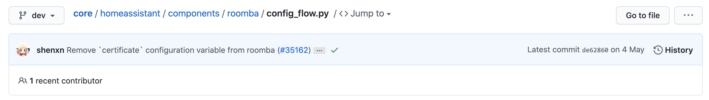
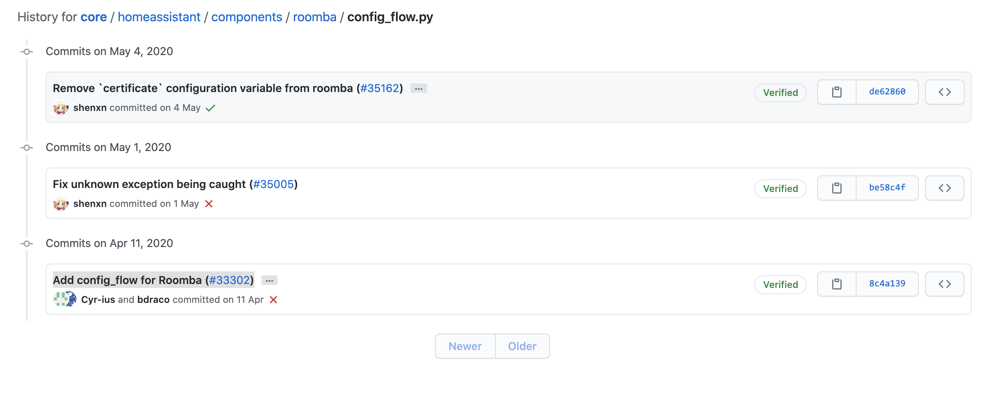
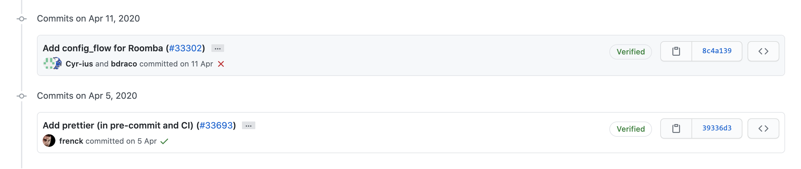
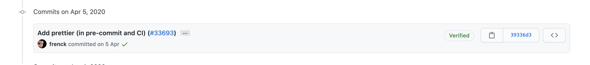
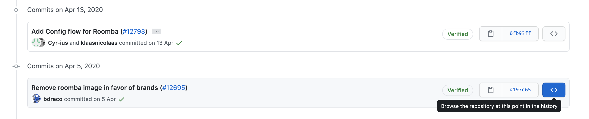

This is an experiment for those of you who stopped updating Home Assistant due to the removal of YAML Components. This experiment shares a way to downgrade your components to the versions where YAML was being used, so you can upgrade the rest of the platform while keeping your old YAML components.

---

## Introduction

Git (GitHub) keeps version control of all changes to components and you can revert to any version. On this process, we will simply download a copy of the home-assistant/core component at a certain point of history, where YAML was still supported.

As such, the key point is that YAML has to have been supported at some point for this to work.

---

## Process

Before you start, it is advisable that you create a backup (a.k.a snapshot) and download it in case something goes wrong and you need to revert to this point in history.

### Finding the right version

The first task is to find the most recent version where YAML was still supported. For this, we are going to go to [home-assistant/core > homeassistant > components](https://github.com/home-assistant/core/tree/dev/homeassistant/components). Then select the platform that you want to downgrade. For this demo, we will use `roomba`.

If UI is the main configuration, there will be a file called "[config_flow.py](https://github.com/home-assistant/core/blob/dev/homeassistant/components/roomba/config_flow.py)", click it and navigate to [History](https://github.com/home-assistant/core/commits/dev/homeassistant/components/roomba/config_flow.py) on top right.



Scroll all the way down and check the date of the first commit. If there are many changes, you many need to click "Older" a few times. In this case, it's `April 11, 2020` and the commit is `Add config_flow for Roomba (#33302)`. This is the commit where `config_flow.py` (UI) was created. We probably want to revert to the version exactly before this one.



Within that view, click now on the name of the platform folder, to go to the [History page for the whole component](https://github.com/home-assistant/core/commits/dev/homeassistant/components/roomba). Your objective now is to find the commit before where `config_flow.py` was added. Again, you may need to click "Older" a few times. Memorizing the date before will help you in doing this faster.




In this case, we want to revert the component to "Add prettier (in pre-commit and CI) (#33693)". The last version before UI was added.

### Downloading the component

#### Via Command Line
If you are familiar with git (GitHub), you can clone the repository at that version ([example](https://github.com/home-assistant/core/issues/35499#issuecomment-628559807)):

```sh
git clone https://github.com/home-assistant/core.git
cd core
git checkout 39336d3ea367e5c50e88fa09165257290a07b150
```

Where `39336d3ea367e5c50e88fa09165257290a07b150` is the commit id. You can get it by clicking on the commit.

Once done, copy the platform folder (e.g. `homeassistant/components/roomba`). See next section to know what to do with it. Once you have copied the folder we need, you can delete the overall folder containing the other files of the `home-assistant/core` repository.


#### Manually

If you are not familiar with git or do not want to clone the repository, there's also a manual way:

Once you have identified the version you want, click the button `[<>]` to revert the view to that commit/point in history.



Once you click it, you will be back to the main `home-assistant/core` folder, but with a key difference. Now, you will be in the view of the repository in the point of history where you selected.

Navigate again to your component folder: [home-assistant/core > homeassistant > components > (e.g. roomba)](https://github.com/home-assistant/core/tree/39336d3ea367e5c50e88fa09165257290a07b150/homeassistant/components/roomba)

Click the files one by one (e.g. `__init__.py`, `manifest.json`, `vacuum.py`) and copy its contents to files with the same name within a folder named exactly like the platform. In this case: `roomba/__init__.py`, `roomba/manifest.json`, etc. If there is a `translations` folder, you can copy only the languages that are relevant to you.

TIP: Clicking "RAW" and then cmd+S or ctrl+S may make this process easier as you can either copy or simply download the files with the right name.

Once you have a folder with all the files in the component, see next section on what to do with it.

### Uploading as a custom_components

Regardless of what method you use to download it, you should have now a folder called like your platform. In our case, `roomba`.

Simply, add the platform folder to your `custom_components` on your system. Your component is now downgraded to support YAML.

However, before restarting, keep reading as you may need to update the configuration.

### Make Changes to the Configuration

You have just downgraded your component to an older version. It is possible that the `configuration.yaml` requires to be downgraded as well. How to know this?

The documentation for the components lives within a different component called `home-assistant/home-assistant.io`. [Access it](https://github.com/home-assistant/home-assistant.io) and navigate to [source/_integrations/](https://github.com/home-assistant/home-assistant.io/tree/current/source/_integrations) and click the file with the platform name you want (e.g. roomba.md).

What you are seeing is the current configuration of the component. What we want now is to revert to the point in history where we downgraded our component. For this, we will go again to History and find the change before our `config_flow.py` was added. In our case, it was April 11. Click on `[<>]` button, to revert the component to that point in history.



Once again, you will be taken to the root directory. Navigate again to [source/_integrations](https://github.com/home-assistant/home-assistant.io/tree/d197c65a62382b2a7969ce012154864ad020ccb6/source/_integrations) and open the platform.md file that you want.

Scroll down to the Configuration section and compare.

TIP: Click in RAW to read it clearly.

For example, in the case of `roomba`, I had to change from:

```yaml
# Example configuration.yaml entry
roomba:
  - host: IP_ADDRESS_OR_HOSTNAME
    blid: BLID
    password: PASSWORD
```

to:

```yaml
# Example configuration.yaml entry
vacuum:
  - platform: roomba
    host: IP_ADDRESS_OR_HOSTNAME
    username: BLID
    password: PASSWORD
```

The change from platform (e.g. `roomba`) to generic device (`vacuum: - platform: roomba`) may be common; but do note that there might be other changes too. For example, here `blid` was the new name for the former `username` and had to revert it.

### Delete existing integration

Once you have downgraded the component by adding it to custom_components and updated the configuration, your YAML configuration and component are ready.

Before restarting, you should remove  the existing configuration to avoid conflicts. Navigate to Configuration > Integrations. Find the integration you want click the 3 vertical dots and click Delete.

### Restart core system

Once the old (new?) UI integration is deleted. You can restart your system. Your YAML configuration should be working now.

### (Optional) Upgrade system

Once you have migrated all the components that you want, you can freely upgrade your home-assistant and your components should still be working as YAML. If new components were migrated to YAML, you may need to repeat this process for all your components.

### (Optional) Manual maintenance

Once you do this, your components will be reverted to old version. Most of them will work as is, however, some may require or could benefit from some maintenance. This is especially true if you want to keep upgrading Home-Assistant.

The most common maintenance that I encountered is migrating from Device to Entity. For example, in the case of roomba I had to change:

```py
from homeassistant.components.vacuum import VacuumDevice

class RoombaVacuum(VacuumDevice):
```

to:

```py
from homeassistant.components.vacuum import VacuumEntity

class RoombaVacuum(VacuumEntity):
```

Other optional improvements could involve migrating from `setup_platform` to `async_setup_platform` to improve system performance.

Now, you are in control of what happens with your components

---

## Risks

1. In general, having old and outdated components is not a recommendable thing to do. However, compared to not updating your whole system, not updating certain components is a lesser security issue and might be preferable.

1. This solution is based on the fact that (1) `custom_components` load before core components and (2) setup_platform and other YAML methods are not meant to be deprecated as per this blog post. If this changes in the future, there will be no way to have YAML components at all.

1. As you are reverting to an older point of history, your components will no longer update and receive improvements or broken changes. For example, imagine that roomba changes its API endpoints. This will completely break the component. (However, this is also true if you're not updating your system). If you want the best of YAML Configuration, while having updates, you will need to create the custom_component yourself. You can read an example on [this PS4 experiment](https://github.com/nitobuendia/yaml-custom-components/tree/58e8a14271a9c57f1835e8a4ba8a2dd26b427422/experiments/ps4#ps4-experiment).
